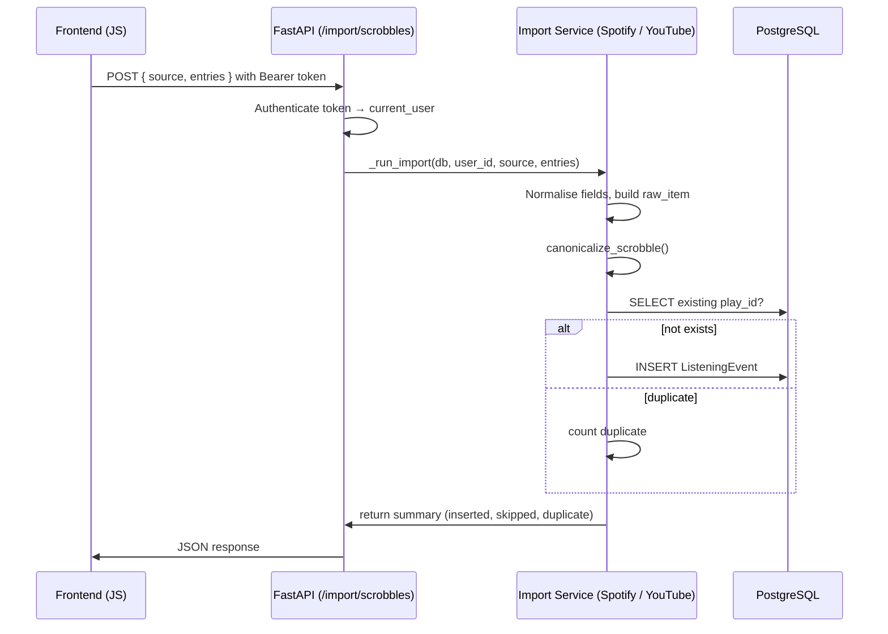

# Import Flow Documentation for YouTube & Spotify

## Overview
The Audio Scrobbler App allows users to import historical listening data from **Spotify** and **YouTube**.  The import process consists of three main layers:
1. **Frontend API** – `frontend/src/api.js` (function `submitImportScrobbles`).
2. **FastAPI endpoint** – `backend/app/api/imports.py` (`/import/scrobbles`).
3. **Backend import services** – `backend/app/services/spotify_import_service.py` and `backend/app/services/youtube_import_service.py`.

The flow is **stateless** on the HTTP layer: the client sends a JSON payload containing the source name (`"spotify"` or `"youtube"`) and an array of raw entries. The backend validates the request, normalises the source, and delegates to the appropriate import service which canonicalises each entry before persisting it as a `ListeningEvent` row.

> **Privacy note** – No user‑specific secrets (e.g., OAuth tokens, API keys) are ever written to the documentation.  All token handling occurs server‑side via the `Authorization: Bearer <token>` header and is abstracted away from the import logic.

---

## 1. Frontend entry point
```javascript
// frontend/src/api.js – submitImportScrobbles
export async function submitImportScrobbles({ token, source, entries }) {
  if (!token) {
    const err = new Error('You are not signed in...');
    err.status = 401;
    throw err;
  }
  const response = await fetch(`${API_BASE_URL}/import/scrobbles`, {
    method: 'POST',
    headers: {
      'Content-Type': 'application/json',
      Authorization: `Bearer ${token}`,
    },
    body: JSON.stringify({ source, entries }),
  });
  return await parseResponse(response);
}
```
*The function:
- adds the `Authorization` header (server verifies the token).
- posts a payload shaped as `{ source: "spotify" | "youtube", entries: [...] }`.
- forwards the response to `parseResponse` which throws on non‑2xx status.
*
---

## 2. FastAPI router (`backend/app/api/imports.py`)
```python
@router.post("/import/scrobbles", response_model=ImportScrobbleResponse)
def import_scrobbles(
    payload: ImportScrobbleRequest,
    db: Session = Depends(get_db),
    current_user: User = Depends(get_current_user),
) -> ImportScrobbleResponse:
    return _run_import(db, current_user.id, payload.source, payload.entries)
```
### Key points
- **Authentication** – `get_current_user` extracts the user from the Bearer token and raises `401` if invalid.
- **Payload validation** – `ImportScrobbleRequest` (pydantic model) ensures `source` is a string and `entries` is a list.
- **Source normalisation** – `_run_import` lower‑cases the source and dispatches to the appropriate service.
- **Error handling** – unsupported sources raise `HTTPException(400)`.

The helper `_run_import`:
```python
def _run_import(db: Session, user_id: int, source: str, entries: list[dict[str, object]]) -> ImportScrobbleResponse:
    normalized_source = source.lower()
    if normalized_source == "spotify":
        summary = import_spotify_history(db, user_id, entries)
    elif normalized_source == "youtube":
        summary = import_youtube_history(db, user_id, entries)
    else:
        raise HTTPException(status_code=status.HTTP_400_BAD_REQUEST, detail="Unsupported import source")
    return ImportScrobbleResponse(
        source=normalized_source,
        summary={
            "inserted": summary["inserted"],
            "skipped": summary["skipped"],
            "duplicate": summary.get("duplicate", 0),
        },
    )
```
It returns a summary indicating how many rows were inserted, skipped, or detected as duplicates.

---

## 3. Spotify import service (`backend/app/services/spotify_import_service.py`)
```python
def import_spotify_history(db: Session, user_id: int, entries: list[dict[str, Any]]) -> dict[str, int]:
    inserted = skipped = duplicate = 0
    for entry in entries:
        # Basic validation – non‑dict entries are ignored
        if not isinstance(entry, dict):
            skipped += 1
            continue
        # Skip podcasts / audiobooks – not music scrobbles
        if entry.get("episode_name") or entry.get("spotify_episode_uri"):
            skipped += 1
            continue
        if entry.get("audiobook_uri") or entry.get("audiobook_title"):
            skipped += 1
            continue

        # Normalise field names (account export vs. extended streaming history)
        track_name = entry.get("trackName") or entry.get("master_metadata_track_name")
        artist_name = entry.get("artistName") or entry.get("master_metadata_album_artist_name")
        end_time = entry.get("endTime") or entry.get("ts")
        track_uri = entry.get("trackUri") or entry.get("spotify_track_uri")
        album_name = entry.get("albumName") or entry.get("master_metadata_album_album_name")
        ms_played = entry.get("msPlayed") if isinstance(entry.get("msPlayed"), int) else entry.get("ms_played")
        platform = entry.get("platform") if isinstance(entry.get("platform"), str) else "spotify"
        country = entry.get("conn_country") if isinstance(entry.get("conn_country"), str) else None

        # Reject malformed essential fields
        if not isinstance(track_name, str) or not isinstance(artist_name, str) or not isinstance(end_time, str):
            skipped += 1
            continue
        if not track_name.strip() or not artist_name.strip() or not end_time.strip():
            skipped += 1
            continue

        # Ensure a valid URI – synthesize a deterministic one for local/unknown tracks
        is_extended = "ts" in entry or "spotify_track_uri" in entry or "master_metadata_track_name" in entry
        if not isinstance(track_uri, str) or not track_uri.strip():
            if is_extended:
                synth_id = hashlib.sha1(f"{artist_name.strip().lower()}:{track_name.strip().lower()}".encode("utf-8")).hexdigest()[:16]
                track_uri = f"spotify:track:local-{synth_id}"
            else:
                skipped += 1
                continue

        raw_item = {
            "play_id": f"{track_uri}:{end_time}",
            "played_at": end_time,
            "track": {
                "id": track_uri,
                "name": track_name,
                "artists": [{"name": artist_name}],
                "album": {"name": album_name if isinstance(album_name, str) else None},
                "duration_ms": ms_played if isinstance(ms_played, int) else None,
            },
            "context": {
                "platform": platform,
                "country": country,
                "raw": entry,
            },
        }

        # Canonicalise – converts raw item into the internal ListeningEvent schema
        try:
            canonical = canonicalize_scrobble(user_id=user_id, source="spotify", raw_item=raw_item)
        except ValueError:
            skipped += 1
            continue

        # Duplicate detection (play_id is unique per user/source)
        existing = (
            db.query(ListeningEvent)
            .filter(
                ListeningEvent.user_id == user_id,
                ListeningEvent.source == "spotify",
                ListeningEvent.play_id == canonical["play_id"],
            )
            .first()
        )
        if existing is not None:
            duplicate += 1
            continue

        record = ListeningEvent(
            user_id=user_id,
            track_id=track_uri,
            track_name=canonical["track_name"],
            artist_name=canonical["artist_name"],
            album_name=canonical["album_name"],
            artwork_url=canonical["artwork_url"],
            played_at=canonical["played_at"],
            duration_ms=canonical["duration_ms"],
            source="spotify",
            play_id=canonical["play_id"],
            payload="",
            raw_metadata=canonical["context"]["raw"],
        )
        db.add(record)
        inserted += 1
    db.commit()
    return {"inserted": inserted, "skipped": skipped, "duplicate": duplicate}
```
### Highlights
- **Field normalisation** – Handles both legacy "Account Data" and newer "Extended Streaming History" column names.
- **Synthetic URIs** – For entries missing a Spotify URI (e.g., local files), a deterministic `spotify:track:local-<hash>` is generated, preserving the play without exposing private data.
- **Canonicalisation** – Delegated to `canonicalize_scrobble` which applies common transformations (e.g., trimming whitespace, lower‑casing artist names).  Errors here are treated as skipped entries.
- **Duplicate guard** – Checks the `play_id` (combination of URI + timestamp) before insertion.
- **Transaction** – All inserts are batched within a single `db.commit()` after looping.

---

## 4. YouTube import service (`backend/app/services/youtube_import_service.py`)
```python
from __future__ import annotations

import hashlib
from datetime import datetime
from typing import Any

from sqlalchemy.orm import Session

from ..models import ListeningEvent
from .canonical_scrobble import canonicalize_scrobble


def import_youtube_history(db: Session, user_id: int, entries: list[dict[str, Any]]) -> dict[str, int]:
    inserted = skipped = duplicate = 0
    for entry in entries:
        if not isinstance(entry, dict):
            skipped += 1
            continue
        # YouTube export may include non‑music videos; we only keep music tracks.
        if not entry.get("music_track"):
            skipped += 1
            continue

        # Normalise fields – YouTube export uses "track", "artist", "playbackTime", etc.
        track_name = entry.get("track")
        artist_name = entry.get("artist")
        end_time = entry.get("playbackTime")
        video_id = entry.get("videoId")
        album_name = entry.get("album")
        ms_played = entry.get("durationMs")
        platform = "youtube"
        country = entry.get("region")

        if not all(isinstance(v, str) for v in (track_name, artist_name, end_time)):
            skipped += 1
            continue
        if not track_name.strip() or not artist_name.strip() or not end_time.strip():
            skipped += 1
            continue

        # Build a deterministic URI if missing (YouTube IDs are always present, but guard anyway)
        if not isinstance(video_id, str) or not video_id.strip():
            synth_id = hashlib.sha1(f"{artist_name.strip().lower()}:{track_name.strip().lower()}".encode("utf-8")).hexdigest()[:16]
            video_id = f"youtube:track:local-{synth_id}"

        raw_item = {
            "play_id": f"{video_id}:{end_time}",
            "played_at": end_time,
            "track": {
                "id": video_id,
                "name": track_name,
                "artists": [{"name": artist_name}],
                "album": {"name": album_name},
                "duration_ms": ms_played,
            },
            "context": {
                "platform": platform,
                "country": country,
                "raw": entry,
            },
        }

        try:
            canonical = canonicalize_scrobble(user_id=user_id, source="youtube", raw_item=raw_item)
        except ValueError:
            skipped += 1
            continue

        existing = (
            db.query(ListeningEvent)
            .filter(
                ListeningEvent.user_id == user_id,
                ListeningEvent.source == "youtube",
                ListeningEvent.play_id == canonical["play_id"],
            )
            .first()
        )
        if existing:
            duplicate += 1
            continue

        record = ListeningEvent(
            user_id=user_id,
            track_id=video_id,
            track_name=canonical["track_name"],
            artist_name=canonical["artist_name"],
            album_name=canonical["album_name"],
            artwork_url=canonical["artwork_url"],
            played_at=canonical["played_at"],
            duration_ms=canonical["duration_ms"],
            source="youtube",
            play_id=canonical["play_id"],
            payload="",
            raw_metadata=canonical["context"]["raw"],
        )
        db.add(record)
        inserted += 1
    db.commit()
    return {"inserted": inserted, "skipped": skipped, "duplicate": duplicate}
```
### Highlights (parallels Spotify)
- **Music‑only filter** – `entry.get("music_track")` guards against generic video entries.
- **Field mapping** – Aligns YouTube export keys to the internal schema.
- **Synthetic URI fallback** – Generates a deterministic `youtube:track:local-<hash>` when a video ID is missing.
- **Duplicate detection** – Same `play_id` strategy as Spotify.
- **Canonicalisation** – Re‑uses the shared `canonicalize_scrobble` helper, ensuring consistent data across sources.

---

## 5. Data model (`backend/app/models.py` excerpt)
```python
class ListeningEvent(Base):
    __tablename__ = "listening_events"
    id = Column(Integer, primary_key=True)
    user_id = Column(Integer, ForeignKey("users.id"), index=True, nullable=False)
    track_id = Column(String, nullable=False)          # Spotify URI or YouTube video ID
    track_name = Column(String, nullable=False)
    artist_name = Column(String, nullable=False)
    album_name = Column(String, nullable=True)
    artwork_url = Column(String, nullable=True)
    played_at = Column(DateTime, nullable=False)      # UTC datetime
    duration_ms = Column(Integer, nullable=True)
    source = Column(String, nullable=False)           # "spotify" or "youtube"
    play_id = Column(String, unique=True, nullable=False)  # deterministic key
    payload = Column(Text)                            # optional raw payload
    raw_metadata = Column(JSON)                       # original entry for debugging
```
*The `play_id` column guarantees uniqueness per user/source, enabling the duplicate‑skip logic in the services.

---

## 6. End‑to‑end sequence diagram (Mermaid)

The diagram visualises the request‑response lifecycle and where duplicate detection occurs.

---

## 7. Extending / Modifying the Import Logic
1. **Add a new source** – Extend `IMPORT_SOURCES` in `imports.py`, create a new service module with an `import_<source>_history` function, and route it through `_run_import`.
2. **Change duplicate policy** – Replace the `play_id` uniqueness check with a more permissive match (e.g., ignore milliseconds) and adjust the `ListeningEvent.play_id` generation accordingly.
3. **Enrich canonicalisation** – Edit `backend/app/services/canonical_scrobble.py` to add extra fields (e.g., genre, track_number) and propagate them through the services.
4. **Batch commit** – For very large imports, you may want to flush/commit in chunks to avoid long transactions. Insert `if inserted % 1000 == 0: db.flush()` inside the loop.

---

## 8. Security & Privacy Checklist
- **Never log** the raw `Authorization` header or token value.
- **Do not expose** `raw_metadata` in any public API response; it is stored only for internal debugging.
- **Validate** that `source` is one of the whitelisted values (`spotify`, `youtube`).
- **Sanitise** all string fields before insertion (the canonicaliser already trims whitespace).
- **Rate‑limit** the `/import/scrobbles` endpoint if abuse is a concern (handled elsewhere in the app).

---

## 9. Testing
The repository includes unit tests under `worker/tests/` that exercise both services with realistic export samples.  Run them with:
```bash
pytest -q worker/tests/test_file_import.py
```
All tests should pass after any modification to the import flow.

---

*Document generated on 2026‑09‑13. No private tokens, user IDs, or environment‑specific values are included.*

